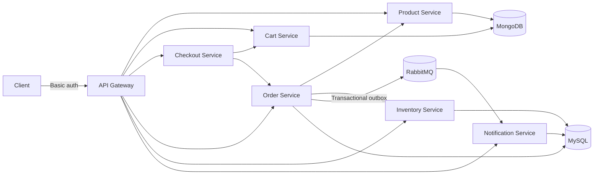

# SpringCart — Microservices E-Commerce Backend

A production-minded Spring Boot e-commerce backend with service discovery,
authenticated edge routing, durable asynchronous events, idempotent checkout,
per-service persistence, and a locally reproducible observability stack.



## Services

| Service | Port | Purpose |
| --- | ---: | --- |
| product-service | 9000 | Product create/list APIs backed by MongoDB |
| order-service | 9001 | Order placement backed by MySQL |
| inventory-service | 9002 | Stock lookup backed by MySQL |
| api-gateway | 9003 | Single HTTP entry point for client requests |
| discovery-server | 9004 | Eureka service registry |
| notification-service | 9005 | RabbitMQ consumer and in-app notification store |
| cart-service | 9006 | Authenticated MongoDB-backed shopping carts |
| checkout-service | 9007 | Idempotent cart-to-order orchestration |

All services register with Eureka. RabbitMQ is the durable order-event bus:
order state changes are committed to a transactional MySQL outbox before they
are published asynchronously, preventing database and broker state from drifting.

## Requirements

- Docker Desktop
- JDK 17 for local Maven runs
- Maven, if running without Docker

The project is configured for Java 17. On Windows, make sure `JAVA_HOME` points to a valid JDK, for example:

```powershell
$env:JAVA_HOME="C:\Program Files\Java\jdk-21"
```

Use a permanent system environment variable if you want Maven to work in every new terminal.

## Run With Docker Compose

Copy the example configuration before starting the stack, then replace every
development credential before using the project outside a local machine:

```powershell
Copy-Item .env.example .env
```

Build and start the whole stack:

```powershell
docker compose up --build
```

Run in the background:

```powershell
docker compose up --build -d
```

Stop everything:

```powershell
docker compose down
```

Stop and remove database volumes:

```powershell
docker compose down -v
```

## API Entry Point

Use the gateway for application traffic:

```text
http://localhost:9003/api/product
http://localhost:9003/api/order
http://localhost:9003/api/inventory
http://localhost:9003/api/cart
http://localhost:9003/api/checkout
http://localhost:9003/api/notification
```

Gateway application routes use HTTP Basic authentication. Configure credentials
with `SHOP_API_USERNAME` and `SHOP_API_PASSWORD`; local defaults are `shop-user`
and `change-me`.

Create a product from PowerShell:

```powershell
$credential = [Convert]::ToBase64String(
  [Text.Encoding]::ASCII.GetBytes("shop-user:change-me")
)
$headers = @{ Authorization = "Basic $credential" }

Invoke-RestMethod -Method Post `
  -Uri http://localhost:9003/api/product `
  -Headers $headers `
  -ContentType application/json `
  -Body '{"skuCode":"Iphone_13","name":"iPhone 13","description":"Apple smartphone","price":699.99}'
```

Get products:

```text
GET http://localhost:9003/api/product
GET http://localhost:9003/api/product?page=0&size=10&sortBy=name
GET http://localhost:9003/api/product/{id}
GET http://localhost:9003/api/product/sku/{skuCode}
```

Place an order:

```http
POST http://localhost:9003/api/order
Content-Type: application/json
Idempotency-Key: checkout-123

{
  "orderLineDtoList": [
    {
      "skuCode": "Iphone_13",
      "quantity": 1
    }
  ]
}
```

Order Service resolves the current product price itself; it never trusts a price
supplied by the client. Successful orders return an order number and reduce
inventory quantity exactly once.

Successful API responses use this envelope:

```json
{
  "success": true,
  "message": "Product fetched",
  "data": {}
}
```

The OpenAPI contract is served by the gateway:

```text
http://localhost:9003/openapi.yaml
```

## Reliability

- Services expose Actuator health at `/actuator/health`.
- API errors use a consistent JSON shape with `timestamp`, `status`, `error`, `message`, and `path`.
- The gateway uses circuit-breaker fallbacks for product, order, and inventory routes.
- The gateway propagates and returns `X-Correlation-Id` for request tracing.
- Order placement calls inventory with a timeout and bounded retry.
- Inventory deduction is idempotent by `orderNumber`, so a retried order deduction request does not reduce stock twice.

Gateway fallback responses return `503 Service Unavailable` when a routed service is temporarily unavailable.

When services are run directly with Maven, the Eureka dashboard is available at:

```text
http://localhost:9004
```

Docker Compose publishes only the API gateway. Databases, Eureka, and application
services remain on the internal Compose network and are not exposed on host ports.

## RabbitMQ Events

- Exchange: `shopping.events` (durable topic exchange)
- Queue: `shopping.order-events` (durable)
- Dead-letter queue: `shopping.order-events.dlq` (durable)
- Routing key: `order.event`
- Events include `ORDER_PENDING`, `ORDER_CONFIRMED`, `ORDER_FAILED`,
  `ORDER_COMPENSATION_REQUIRED`, `ORDER_CANCELLATION_REQUESTED`, and
  `ORDER_CANCELLED`.

Configure the broker with `RABBITMQ_USERNAME` and `RABBITMQ_PASSWORD`. Publishing
uses broker confirms; failed deliveries remain in `t_order_outbox` and are retried.
Notification Service consumes these messages idempotently by `eventId`, stores them
in MySQL, retries transient failures three times, and dead-letters invalid messages.

Fetch stored notifications through the authenticated gateway:

```text
GET http://localhost:9003/api/notification?page=0&size=20
GET http://localhost:9003/api/notification/unread-count
PATCH http://localhost:9003/api/notification/{id}/read
PATCH http://localhost:9003/api/notification/read-all
GET http://localhost:9003/api/notification/preferences
PUT http://localhost:9003/api/notification/preferences
```

Notification records have read/unread state. Per-user preferences can disable
individual order-event categories without stopping event consumption or delivery
for other users.

## Cart and Checkout

```http
PUT http://localhost:9003/api/cart/items/Iphone_13
Authorization: Basic <credentials>
Content-Type: application/json

{"quantity": 2}
```

Checkout resolves authoritative prices through Order Service and clears the cart
only after an order succeeds. Retrying with the same key replays the same order.

```http
POST http://localhost:9003/api/checkout
Authorization: Basic <credentials>
Idempotency-Key: checkout-123
```

## Gateway Protection

Routed requests are limited per authenticated user using Redis. Defaults are 20
requests/second with a burst of 40, and request bodies are capped at 1 MB. Configure
these with `GATEWAY_RATE_PER_SECOND`, `GATEWAY_BURST_CAPACITY`, and
`GATEWAY_MAX_REQUEST_SIZE`.

## Observability

- Grafana: `http://localhost:3000`
- Prometheus: `http://localhost:9090`
- Alertmanager: `http://localhost:9093`
- Zipkin: `http://localhost:9411`
- Loki receives all Compose container logs through Promtail.

Grafana is provisioned with Prometheus, Loki, and Zipkin data sources. Prometheus
alerts when a service is down or the aggregate HTTP 5xx rate exceeds 5%.
The local Grafana login defaults to `admin` / `admin` and is configurable through
`GRAFANA_USERNAME` and `GRAFANA_PASSWORD`.

## End-to-End Verification

The regular test suite does not require Docker. The explicit E2E profile builds and
starts the complete Compose stack and exercises MongoDB carts, MySQL orders,
RabbitMQ notifications, Redis gateway policies, and request-size rejection:

```powershell
mvn verify -Pe2e -pl integration-tests -am
```

## Local Maven Verification

Run all tests:

```powershell
mvn test
```

Validate the resolved Compose model without starting containers:

```powershell
docker compose config --quiet
```

If Maven reports that `JAVA_HOME` is invalid, point it to a valid JDK before running the command.
